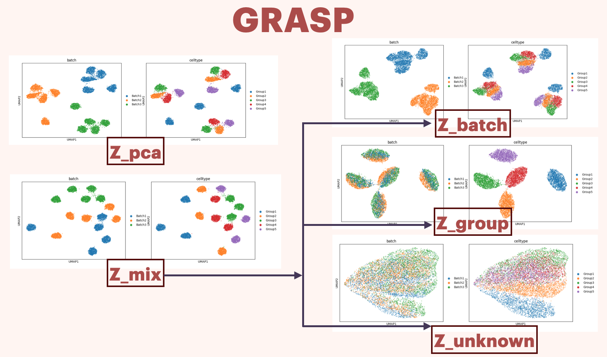

# GRASP - Graphical Representation Analysis of Single-cell Perturbations

    

### GRASP model:
- Pre train steps:
    -   Use any latent space representation model (such as pca) to obtain z_pca
    -   Generate graph based on z_pca space and project it to batch space and group space
- GRASP training :
    - input : raw data and two graphs in batch space and group space
    - model :
        - Encode raw data to z_mix
        - Capture batch effect z_batch using GNN(z_mix,batch space graph) 
        - Capture group effect z_group using GNN(z_mix,group space graph) 
        - Isolate z_unknown from FCN (z_mix, [z_batch + z_group])
        - Reconstruct data using z_batch + z_group + z_unknown
        - Discriminator learning for batch and group effect

        